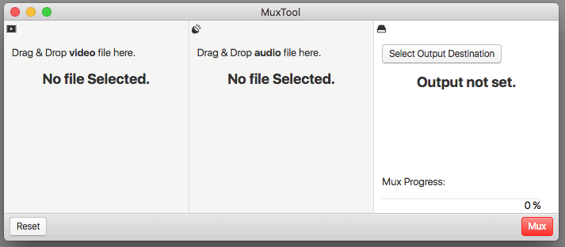

# MuxTool
Combine audio and video streams from different files. This can be useful when you want to add multi-channel audio (eg. ac3) to a video file for playback in multimedia installations.

## Usage Notes
Download the latest MuxTool.zip [here](https://github.com/telega/MuxTool/releases/latest). 

* Drag and Drop

* Doesn't encode, just rams the files together so the quality shouldn't suffer.

* It isn't very intelligent, so if your source files are strange, it may not work for you. 

## Background

This is a GUI frontend for [FFmpeg](https://www.ffmpeg.org/) made with [Fluent-FFmpeg](https://github.com/fluent-ffmpeg/node-fluent-ffmpeg), [Electron](http://electron.atom.io/), [Photon](http://photonkit.com/), [ProgressBar.js](https://github.com/kimmobrunfeldt/progressbar.js) 

## Building 

Binary [available](https://github.com/telega/MuxTool/releases/latest) for macOS. You should be able to build binaries for other platforms easily by cloning the repo using npm to install the dependencies (including the appropriate FFmpeg binary), and building it with the [electron-packager](https://www.npmjs.com/package/electron-packager). There is a bit in the renderer where it plays the macOS sound on completion which you may need to take out. 
